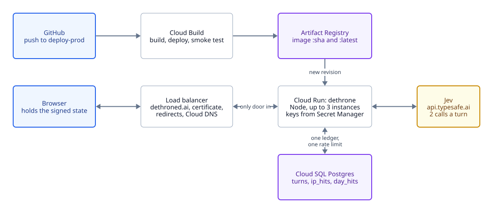

# Architecture

<picture>
  <source media="(prefers-color-scheme: dark)" srcset="diagrams/architecture-dark.svg">
  
</picture>

Plain Node 20+, no build step, static files, and one package: `pg`. Everything is in the GCP project
`dethroned-ai`, region `us-east4`, and all of it is in `terraform/`.

## The request path

- **Browser.** Holds the game: the king, the meters, the year, the hand. It cannot write the state,
  only carry it: the server signs it. See [Integrity](integrity.md).
- **Load balancer.** A global external Application Load Balancer with a static IP, a managed
  certificate for the apex and www, redirects from www and from HTTP, and a Cloud DNS zone that
  Namecheap delegates to. Cloud Run's ingress is closed to everything else, so the `*.run.app` URL
  answers 404.
- **Cloud Run, `dethrone`.** Up to 3 instances, 80 concurrent requests each, 512 MiB, scale to
  zero. It reads `TYPESAFE_API_KEY`, `STATE_SECRET` and `PGPASSWORD` from Secret Manager. Instances
  share nothing in memory that matters: the ledger and the counters are in Postgres.
- **Jev.** `POST https://api.typesafe.ai/v1/systemone` with a state and typed questions; 1,200
  requests a minute, which is 600 turns, is the real ceiling on the whole system.
- **Cloud SQL.** Postgres 17, reached over Cloud Run's built-in socket with no VPC and no proxy.
  Three tables: `turns` (the chronicle), `ip_hits` and `day_hits` (the limits).

## The files

| File | What it does |
| --- | --- |
| `server.js` | HTTP, static files, the API, the limits, signing, mock mode |
| `game.js` | The rules and the prompts. Pure, no I/O |
| `db.js` | The Postgres pool, the schema (created on start under an advisory lock), the counters |
| `log.js` | The decision log: memory, Postgres or a local file |
| `stats.js` | The chronicle's aggregates, and `redact` |
| `deck.json` | The 96 petitions |
| `public/` | `index.html`, `app.js`, `style.css` for the game; `eval.html`, `eval.js` for the chronicle |
| `scripts/` | Caching Jev's answers, the Monte Carlo balance runs, the two-call experiment |
| `terraform/`, `infra/` | The project, and the build that deploys it |

## The API

| Route | Does |
| --- | --- |
| `GET /api/reign` | A new king, the deck, and the first signed token |
| `POST /api/turn` | Plays one year. Body: `{ token, i }` for a deck card or `{ token, custom }` for a written one |
| `GET /api/eval` | The chronicle's summary, cached for 10 seconds |
| `GET /api/eval/turn/<id>` | One full record, redacted if the petition was written by a player |
| `GET /api/eval/export` | Every record as JSONL, redacted the same way |

## Decisions that are settled

- **Node, not Laravel.** A port was considered and dropped: heavier, one request per PHP worker, and
  it would need the database anyway.
- **Postgres, not a JSONL file in a bucket.** Several instances need one ledger and one rate limit.
- **No second model.** Jev decides and never writes. Every word on screen is authored; adding a
  language model to generate text would break the premise.
- **Its own load balancer.** The project has no organisation, and cross-project backends need
  Shared VPC inside one, so it cannot share the balancer in front of the author's other sites.
