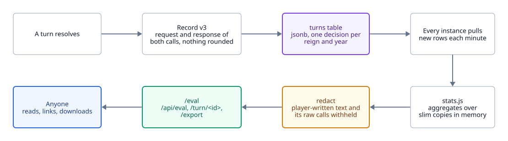

# The chronicle

<picture>
  <source media="(prefers-color-scheme: dark)" srcset="diagrams/chronicle-dark.svg">
  
</picture>

`/eval` is a public ledger of every turn anyone has played, and a live eval of Jev on real play.

## The record

One per turn, currently `v: 3`. It holds the exact request and response of both Jev calls in
`calls`, untouched, plus summary fields derived from them: the king, the meters before and after,
the card, `want`, `know`, `blend`, `roll`, `trap`, the eight scores, the predicted and applied
changes, the death if any, latency, tokens, and the prompt variant and step in force. Nothing is
rounded, so any analysis can be redone from the log. A record is about 8 KB.

When the shape changes, `v` goes up. `v: 2` records predate signed state: their king, meters and
year came from the client, so treat them as unverified.

## Where it lives

With Postgres (production), the `turns` table: `id`, `t`, `reign` and `mock` as columns and the
whole record as `jsonb`. Each instance inserts its own turns and pulls the others' rows once a
minute, so there is one chronicle however many instances serve the game. Memory holds a slim copy of
every record for the statistics and the full record of the most recent 2,000; older ones are read
back from the table when a turn is opened. Without Postgres, records go to `data/log/turns.jsonl`.

Mock-mode turns are logged with `mock: true` and left out of the public numbers when a real key is
set.

## What the page reports

- How reigns end, by cause and by length.
- Per temperament: how often the in-character answer wanted the bait on flaw-targeted cards, how
  often the crown took it after the advisor and the roll, and the same first-option rate on other
  cards as the control.
- The advisor: on turns with a meter within 20 of an edge, how often the second call picked the
  option the model's own forecasts say is safer.
- The trap reading on targeted, untargeted and player-written petitions.
- The share of each forecast level, the most played cards, and the cards the same temperament
  answered differently on different plays.

Every entry opens into both calls as they happened and the arithmetic from wants and knows to the
applied changes. `/eval?turn=<id>` is a permalink.

## Player-written petitions

Their text is never shown and never exported: `redact` blanks the card and withholds the raw calls,
which quote it. They are also not a clean sample of the model on the authored deck, so those turns
count only in their own trap reading, and a reign that heard one is left out of reign lengths and
deaths and counted separately.

`CUSTOM_TEXT_DAYS`, off by default, blanks written text in the table itself after that many days
and keeps the numbers.

## Querying it

Prefer SQL over the `jsonb` record to adding summary columns.

```sql
-- how often each temperament wanted the bait on cards aimed at it
select record->'king'->>'flaw' as flaw,
       count(*) as turns,
       avg(((record->>'want')::float >= 0.5)::int) as wanted_bait
from turns
where not mock
  and (record->>'v')::int >= 3
  and record->'card'->>'tag' = record->'king'->>'flaw'
group by 1 order by 1;
```

`GET /api/eval/export` streams every record as JSONL for work outside the database.
