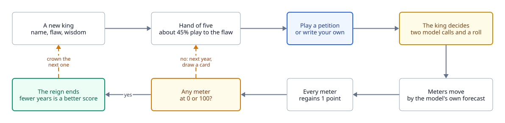

# Gameplay

<picture>
  <source media="(prefers-color-scheme: dark)" srcset="diagrams/gameplay-loop-dark.svg">
  
</picture>

Jev is the king. You are the court, and you want him gone. Each year you put one petition in front
of him; he picks one of its two options; the four meters move. The reign ends when any meter
reaches 0 or 100, and the score is the number of years it took. Fewer is better.

## The king

`/api/reign` makes a king with three things, all visible to the player:

- **A name**, such as Hildegard V.
- **A flaw**, one of six: vain, pious, greedy, warlike, paranoid, indolent. The flaw is written into
  the prompt for the in-character decision ("a monarch who cannot resist flattery and would rather
  die than look weak").
- **Wisdom**, between 0.15 and 0.85, shown as Reckless (under 0.35), Wary, or Shrewd (0.65 and up).
  It is the weight given to the sober advisor's answer over the king's own. See [A turn](turn.md).

Every meter starts at 50.

## The deck and the hand

`deck.json` holds 96 authored petitions. Each has a speaker, a message, a left and a right option,
and a tag: one of the six flaws, or `any`. On a flaw-tagged card the tempting option is always the
left one; the chronicle's bait statistics rely on that.

The hand is five cards. Each draw has a 45% chance of coming from the pile that targets this king's
flaw, and those cards get a gold edge. A played card is replaced; when the piles run out they are
reshuffled.

The player can also write a petition. It is sent to the model like any other, but it is kept out of
the public numbers and its text is never shown. See [Integrity](integrity.md) and
[The chronicle](chronicle.md).

## What moves the meters

The model forecasts the effect of each option on each faction on a five-level rubric: collapses,
falls, unchanged, rises, surges. A level is worth `EFFECT_STEP` = 12 points either side of
"unchanged", so one turn can move a meter by at most 24. The forecasts for the option the king chose
are what is applied. Then every meter gains `RECOVERY` = 1 point, so a quiet realm drifts upward
and a reign can end at the top as well as the bottom.

Before the king commits, the page shows a ghost tick on each meter for both options: the player
sees what the model expects before seeing what it chose.

## Deaths

Eight of them, one per faction and edge, each with an authored text: excommunicated or retired to a
monastery, revolution or loved too well, invaded or a coup, bankrupt or poisoned for the hoard.

## Balance

The constants were not guessed. `scripts/cache-effects.mjs` asks Jev about every card under every
flaw and caches the answers; `scripts/montecarlo.mjs` plays thousands of reigns against the cache
with different constants. The target, which `EFFECT_STEP` 12, `RECOVERY` 1 and the "calm" forecast
prompt hit: a player choosing at random lasts about 18 years at the median, a ruthless one about 12,
and deaths are split between the low and high edges.

Prompt wording is a tuning parameter too. The "calm" wording of the forecast question cut "falls"
from 42% of answers to 25%. When a prompt or a card changes, re-cache and re-run before trusting the
balance.
