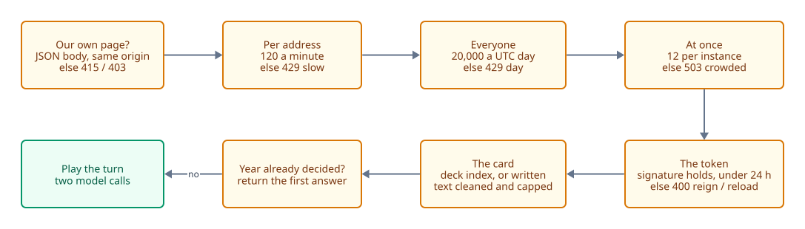

# Integrity

<picture>
  <source media="(prefers-color-scheme: dark)" srcset="diagrams/gauntlet-dark.svg">
  
</picture>

The chronicle is public and is meant to be a dataset, so the question for every turn is: was this
really played, once, from a state the server produced? The gates above run in that order, cheapest
first, and nothing reaches Jev until all of them pass.

## Signed state

The server keeps no session. `/api/reign` signs the reign id, the king, the meters and the year
into a token (HMAC-SHA256 with `STATE_SECRET`), and the browser sends it back with each turn. The
response to a turn carries the token for the next year. The client can read the state; it cannot
write it. A forged king, a meter set to 1, a made-up year: none of them verify.

Before this, the request body carried the king and the meters, and one `curl` loop could have
written any death count or bait rate it liked into the public numbers. Do not go back to that.

- Tokens expire after 24 hours. A dead reign gets no further token.
- On Cloud Run the server refuses to start without `STATE_SECRET`: instances must agree on the key.
  Terraform generates it. Locally a key is made up at start, so reigns end when the server restarts.
- Rotating the secret ends the reigns in progress and nothing else.

## One decision per year

A unique index on `(reign, year)` allows one record per year of a reign. A token played twice gets
the first answer back, marked `replayed`, whatever card came with it. That makes a lost response
safe to retry, and makes a bad roll impossible to re-roll. Two requests racing on one year both get
the winner's answer.

## Cards

A deck card is sent as its index and the server takes the text from `deck.json`. Free text only
arrives as a written petition, which is always tagged `custom`. Together with the king's name coming
from the token, that means the only player-written text in any record is in a `custom` card.

Written text is normalised (NFKC), stripped of invisible and bidi-override characters, collapsed to
single spaces, and cut by whole character to 600 for the message, 60 for the speaker and 40 for each
option. Injection into the prompt can only skew probabilities: Jev returns typed answers, not text.

## The limits

| Limit | Value | Counted | The player sees |
| --- | --- | --- | --- |
| Per address | 120 turns a calendar minute | Postgres, across instances | The court is weary, with a countdown |
| Everyone | 20,000 turns a UTC day | Postgres | The court is closed |
| At once | 12 turns per instance | In memory, per instance on purpose | The hall is full |

The per-address and daily counters are incremented before the body is read, so refused and
malformed requests count. Change the values in `terraform/variables.tf`, not the console.

The client address is read from the right of `X-Forwarded-For` (`XFF_FROM_RIGHT` = 2 behind the
balancer): the left of that header is whatever the client sent.

`/api/turn` refuses a body that is not declared as JSON, and any request a browser marks as coming
from another site, so another page cannot spend its visitors' allowance here. HTML is served with a
Content-Security-Policy that allows scripts from this origin only.

## A turn never fails silently

Every refusal carries a `code` and, where waiting helps, `retryIn` seconds. The page turns it into
a notice in the middle of the stage.

| Code | Notice | Then |
| --- | --- | --- |
| `slow`, `day`, `crowded` | The limits above | Back to court; the card is returned to the hand |
| `model` | The king is silent | Jev failed or timed out. Its own error text stays in the server log |
| `reign` | This reign is over | The token is bad or stale: crown the next one |
| `reload` | The court has moved | No token at all: the page predates a release, so it reloads |

A written petition that was refused comes back in its form with the text intact.

## What is not defended

A player can post any of the 96 deck indexes, not only the five in their hand; dealing happens in
the browser. That skews which cards get played, not what the model answers to them. There are no
accounts and no CAPTCHA, by choice.
