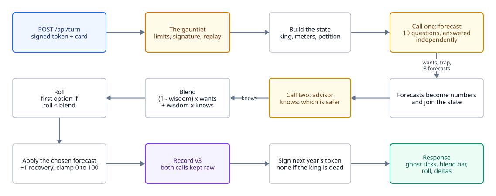

# A turn

<picture>
  <source media="(prefers-color-scheme: dark)" srcset="diagrams/turn-dark.svg">
  
</picture>

One `POST /api/turn` is two calls to Jev and one record. For the same thing with real numbers in it,
see [A real turn, call by call](example-turn.md).

The code is `server.js` for the request and
`game.js` for everything about the rules: `buildState`, `buildQuestions`, `buildAdvisorCall` and
`resolveTurn` are pure functions, and the scripts import them too.

## Call one: forecast

The state is the year, the king (name, temperament, wisdom), the four meters with a warning for any
within 20 of an edge, and the petition. Ten questions go in one call:

| Question | Type | Asks |
| --- | --- | --- |
| `decision` | choice | In character, which option would this monarch pick? This is **wants**. |
| `trap` | noul | Is the petitioner steering the king toward ruin by playing on his temperament? |
| `left_church` ... `right_treasury` | score, 8 of them | As a neutral chronicler, what happens to this faction if the king picks this option? |

## Call two: advisor

Jev answers the questions in one call independently: it does not reason from one answer to another.
An advisor asked "which option is safer" alongside the forecasts cannot see them. So the eight
forecasts are turned into point changes, put into the state as numbers, and a second call asks one
question, `prudence`: ignoring the king's temperament, which option keeps the realm alive? This is
**knows**.

`scripts/two-call.mjs` measured the difference. On turns with a meter in danger, the advisor picked
the option its own forecasts said was safer 56% of the time in one call, and 89% with the second
call.

## Blend and roll

```
blend = (1 - wisdom) x wants + wisdom x knows      # probability of the left option
roll  = a random number from 0 to 1
the king takes the left option if roll < blend
```

The decision is a dice roll and the page says so: "rolled 71 against 28". Jev's probabilities are
often 1.0 or 0.0, so taking the most likely option would make wisdom meaningless; sampling from the
blend makes it a real probability. The roll is stored in the record, so a surprising outcome can be
traced to the dice and not blamed on the model.

## After the roll

The forecasts for the chosen option are applied, each meter gains 1, and values are clamped to 0 to
100. A meter at either end is a death. The record is written (see [The chronicle](chronicle.md)),
and the response carries a signed token for next year, or none if the king is dead (see
[Integrity](integrity.md)).

The response is built from the record alone (`turnResponse`), so a turn answered fresh and the same
turn asked for again are byte for byte the same answer.

## Cost and speed

About 2,700 input tokens a turn at $0.042 per million: a dollar is roughly 450 full games. A turn
takes 300 to 700 ms, almost all of it the two calls. Without an API key the server answers from a
deterministic fake (`npm run mock`), which is enough to work on the page.
